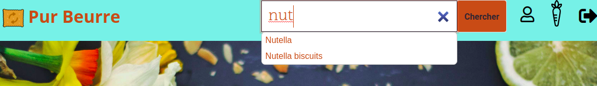

### 1. Objet du projet 8 - plateforme PurBeurre :

Réalisation d'une application qui permet de trouver des substituts plus sains à des aliments trop gras ou trop sucrés à partir de recherches sur la plateforme libre et ouverte OpenFoodFacts dont l'objectif est de répertorier les caractéristiques nutritives de produits alimentaires commercialisés dans le monde entier.

### 2. Ressources extérieures utilisées :
- API OpenFoodFacts.

### 3. Outils
- Développement en python 3.6,
- Base de données PostgreSQL 12.2,
- Gestion des templates et des tables avec Django 3.03,
- Design avec Bootstrap 4.
- Déploiement sur la plateforme Heroku - lien : https://purbeurre8app.herokuapp.com/

### 4. Installation des dépendances
- pip install -r requirements.txt

### 5. Tests
- Lancer les tests : **_coverage run manage.py test_**
- Editer le rapport du coverage : **_coverage report -m_**

### 6. Lancement en local
**Créer et remplir la base de données** : la commande de lancement permet de sélectionner le nombre de catégories entre 5 et 20. 
20 produits par catégories sont ensuite automatiquement sélectionnés.

- Commande de lancement = **_python manage.py populateDb 10_**

- Lancer l'application : **_python manage.py runserver_**

